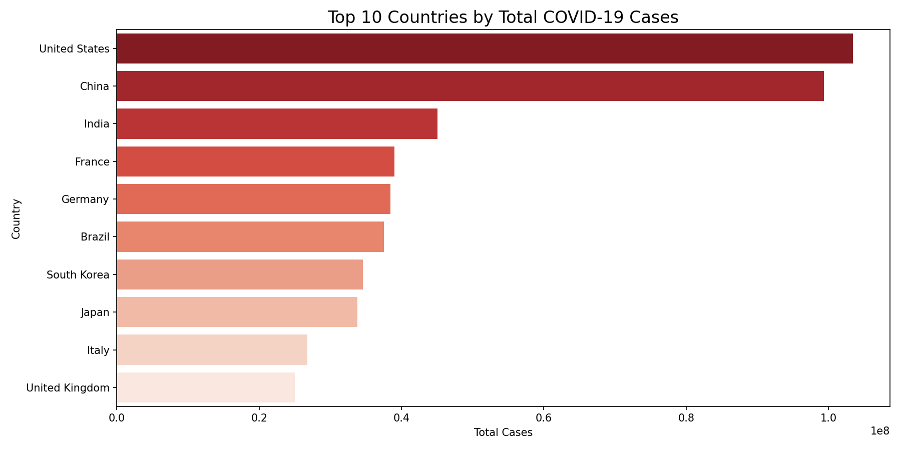
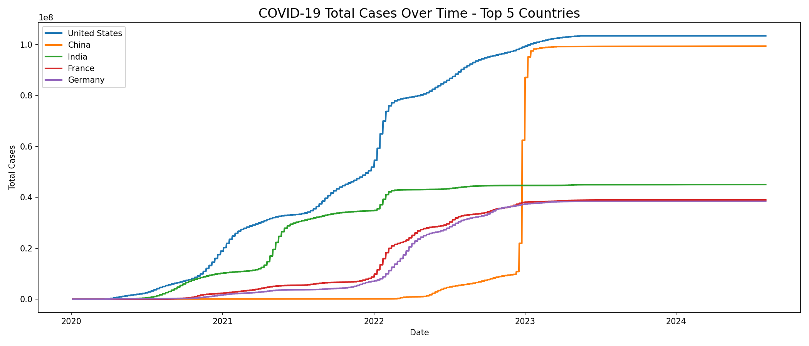
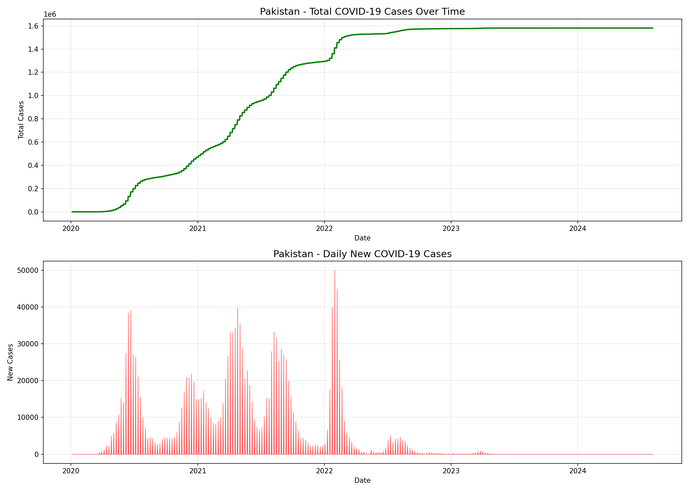
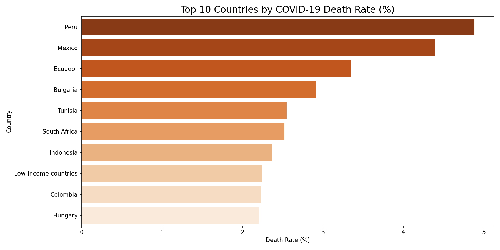

# 🦠 COVID-19 Global Data Analysis

Analyzed real COVID-19 data of 255 countries from 2020-2024.

## 📊 Key Findings
- USA had the most cases worldwide
- China had a massive spike in 2023 (Omicron!)
- Pakistan had 4 clear COVID waves
- Peru had the highest death rate (4.9%)
- Pakistan controlled COVID by 2023 💪

## 📈 Visualizations

## 🛠️ Tools Used
Python | Pandas | Matplotlib | Seaborn | NumPy

## ▶️ How to Run
jupyter notebook covid19_data_analysis.ipynb
